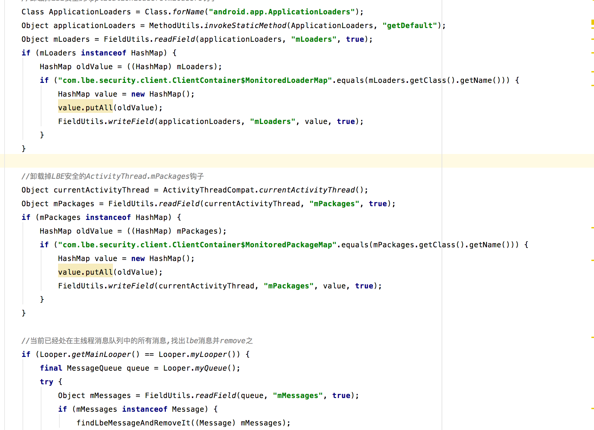
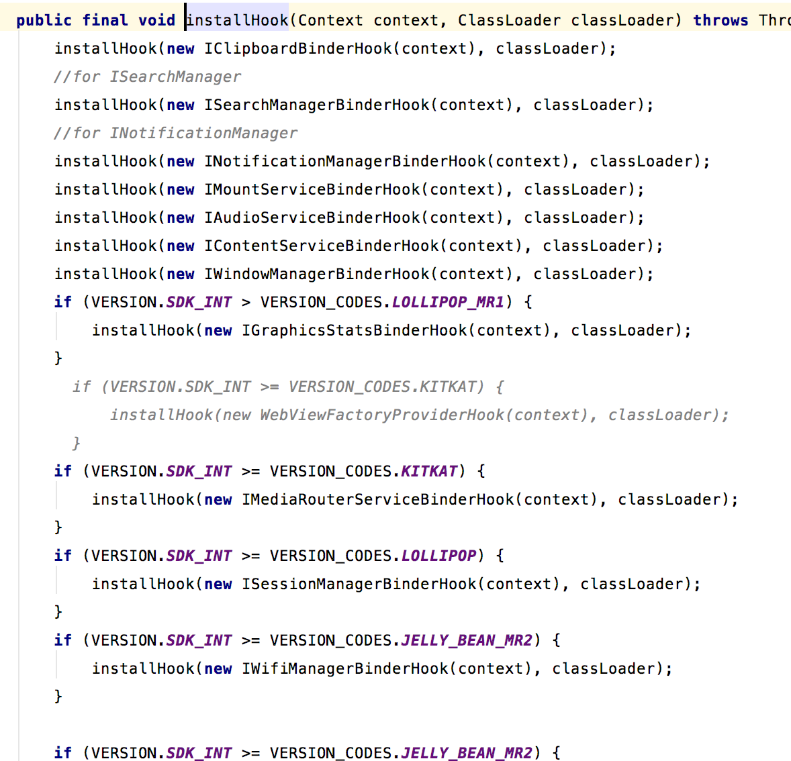
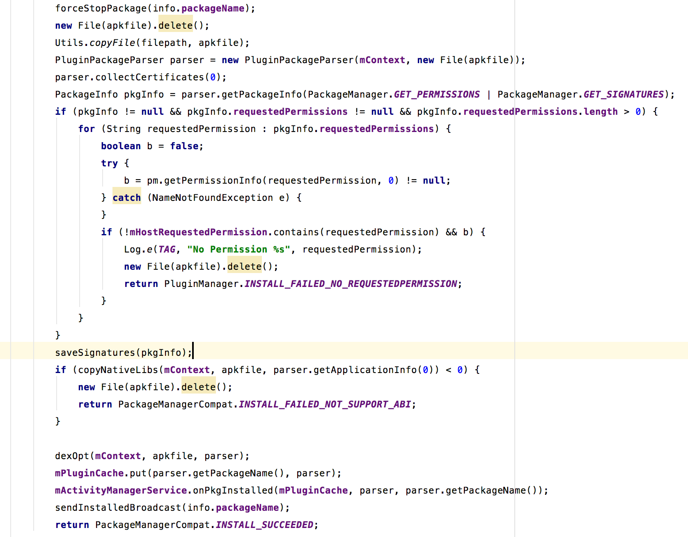

### 1.从Application说起

在PluginApplication中，在attachBaseContext方法中，只是初始化crashhandler去收集crashlog，而在oncreate方法中，调用PluginHelper去初始化我们的插件相关的东西，去看下代码。在这个方法中，会调用initPlugin去初始化我们的插件，步骤如下：

* fixMiUiLbeSecurity 解决小米安全中心广告拦截组建白屏问题
* PluginPatchManager.getInstance().init(baseContext) 
* PluginProcessManager.installHook(baseContext) hook系统各种服务，上天的操作。
* 判断是否为插件进程，然后设置是否可hook
* PluginManager.getInstance().init(baseContext); 初始化插件管理服务

### 2.fixMiUiLbeSecurity

我们先看下代码。



从代码中可以看粗，干了三件事。

1. 替换ApplicationLoaders中MonitoredLoaderMap 替换为hashmap
2. 替换ActivityThread中MonitoredPackageMap为普通hashmap
3. 找出lbe消息并remove掉


### 3.installHook

看下代码

这个方法中有大量的hook 系统服务的操作，我们后续再说。

### 4.setHookEnable

根据是否为插件进程，设置是否允许hook

### 5.绑定插件管理服务

这个负责我们的一些插件管理，后面在做记录。这样，插件的初始化过程就完毕了。ps:虽然到这里啥也没说。

### 6.插件的install过程
```
int code = PluginManager.getInstance().installPackage(
                            new File("/sdcard/plugin.apk").getAbsolutePath()
                            , 0);
```

插件的安装代码如上，上面的代码实现在IPluginManagerImpl#installPackage,代码比较长，来分段看看。

首先获取到apkfile的地址，因为作者要求我们传入flag为0，我们就看else分支了。看下else分支代码。


* 判断插件是否已经加载过，已经加载过直接返回false
* 如果可以的话，forceStopPackage方法kill到插件进程
* 将我们插件复制到apkpath对应的位置
* 验证签名 获取packageinfo并保存
* copy lib文件
* dexopt
* 后续操作，如放入cache，。。。


整体过程就是上面。