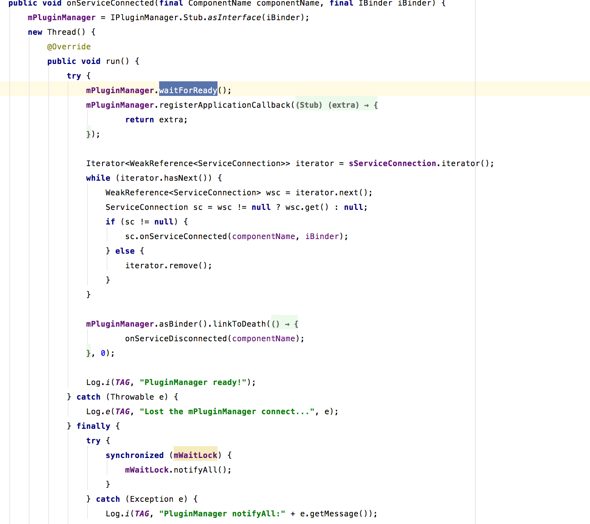

## 插件的管理

在PluginHelper的initPlugin方法中，会初始化PluginManager，在PluginManager中会bind插件管理服务。

### 1.PluginManagerService

在PluginManagerService中，进行了简单的保活处理，并且构造IPluginManagerImpl，调用其onCreate方法去做一些操作。PluginManagerService是模仿系统的PackageManagerService，提供对插件的简单管理服务。

### 2.IPluginManagerImpl＃onCreateInner

在这个方法中国年，加载所有对的插件，加载宿主程序要求的权限，先看loadAllPlugin的实现，主要逻辑分为三个步骤。

#### 2.1 loadAllPlugin

* 找出/data/data/com.HOST.PACKAGE/Plugin下的所有apk文件
* 对找出的apk文件签名校验
* MyActivityManagerService#onCreate 做一些相关的初始化操作

MyActivityManagerService的父类是BaseActivityManagerService，在这个类的onCreate中，会创建MyRemoteCallbackList，用来监听aidl服务端的死亡。

MyActivityManagerService#onCreate

        AttributeCache.init(mHostContext);
        mStaticProcessList.onCreate(mHostContext);
        mRunningProcessList.setContext(mHostContext);
        
StaticProcessListd的onCreate中，获取占桩的四大组件和对应的进程信息。

#### 2.2 loadHostRequestedPermission

这一步操作比较简单，就是获取host程序中的权限并缓存起来

经过上面的步骤，就完成了插件管理的初始化。

_ _ _

这里的插件管理也是c/s的，s端为PluginManagerService，真实实现为IPluginManagerImpl，客户端为PluginManager。

### 3.客户端PluginManager

首先看下其onServiceConnected方法的实现。

其中mPluginManager对应的为IPluginManagerImpl。

* 等待IPluginManagerImpl初始化完毕
* 注册ApplicationCallback，对应aidi，IApplicationCallback
* sServiceConnection，在多进程模式下会有多个，是在PluginHelper#initPlugin中添加的
* 调用pluginhelper#onServiceConnected(因为这里的sServiceConnection中缓存的就是pluginhelper对象)
* 给IPluginManagerImpl设置死亡代理，死亡的时候重新连接

而PluginHelper#onServiceConnected只是设为hooked

