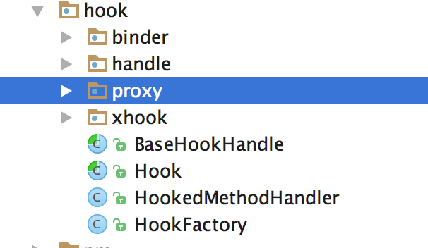
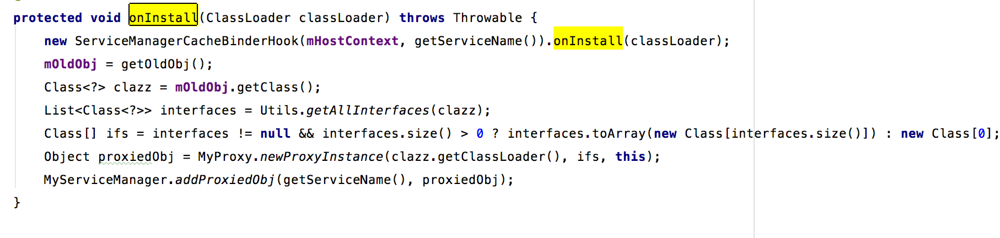
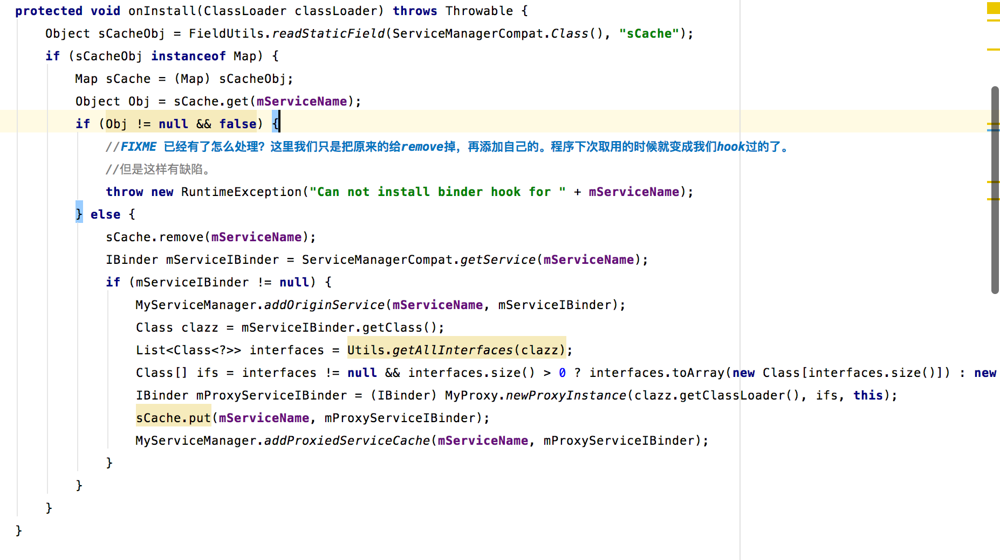
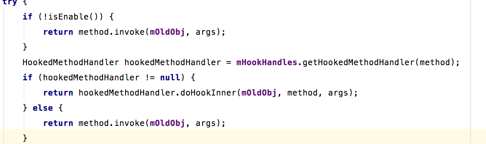

### 1.Binder的hook过程
Binder的hook过程涉及到 hook包下的所有内容，包结构如下：


* binder binderhook，把控hook的流程
* handle 代理对象，用于替换系统对应的各种系统服务
* proxy 也是代理对象，用于替换系统各种管理对象，如activitymanager、packagemanager等
* 基类

### 2.整体调用过程

在installHook的方法中，会调用hook的oninstall方法。而这个方法的实现在BinderHook以及proxy下的各个类。先看BinderHook。


```
new ServiceManagerCacheBinderHook(mHostContext, getServiceName()).onInstall(classLoader);
```
ServiceManagerCacheBinderHook的onInstall代码如下：



* 取出servicemanager中原始的binder对象
* hook掉系统对应的binder对象
* 将代理对象放入到cache中
* MyServiceManager 缓存代理对象

回到BinderHook的onInstall方法。接下来的步骤是这样子的

* 从我们MyServiceManager中获取院士的binder对象
* 生成动态代理对象
* 将代理对象添加到MyServiceManager中（注意和上面的区别，一个是cachebinder，一个是binder）


### 3.BinderHook

ServiceManagerCacheBinderHook和BinderHook的invoke方法的实现一致，因此我们只看下BinderHook的invoke实现。其中关键实现代码如下：


剩下的方法就是做一些异常处理

* 判断时候允许hook
	* 如果不允许直接调用原对象的方法
	* 如果允许的话
		* mHookHandles.getHookedMethodHandler获取HookedMethodHandler，这个mHookHandles是在hook初始化的时候，通过createHookHandle生成的，createHookHandle的具体实现对应于各个binderhook对象，如IClipboardBinderHook,而他们对应new出handle包下的类实例。
		* 调用IClipboardBinderHook的doHookInner去hook对应的方法。


通过上面的一系列操作，我们最终的hook操作转移到了hanlde包下的类。当然，还有一些是在proxy包下。具体的过程是类似的。

现在，我们需要关注的就是handle包和proxy包。稍后在介绍。


