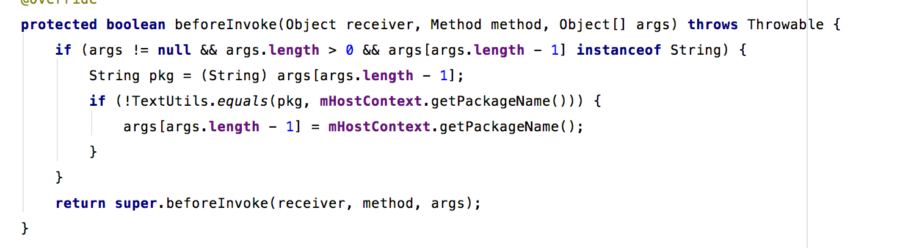

Hook的过程。

* IClipboardBinderHook，hook操作发生在IClipboardHookHandle中，我们通过查看源码可知，是将插件apk的包名替换成宿主apk的包名，来绕过系统的验证。

* ISearchManagerBinderHook,替换插件的ComponentName为预占坑的的ComponentName。
* INotificationManagerBinderHook，以简单的api为例，enqueueToast，读出序列中的view和nextview，并修改其中mcontext字段为宿主context
* IMountServiceBinderHook，hook掉mkdir方法，这个方法有两个参数，第一个是callingpkg，第二个是apppatch，这里将这两个参数都替换掉
* IAudioServiceBinderHook，以adjustVolume为例，我们只需要替换包名即可
* 省略一大堆
_ _ _
>我们可以发现，到现在处理就两种情况，一种，简单的替换包名，另一种，用我们占坑的四大组件来替换，

_ _ _

>有些情况下，系统api需要返回结果，这个时候我们hook之后，需要调用afterInvoke，返回结果的代理对象。如IWindowManagerHookHandle,相应的代理对象在proxy包下。而这些类大多做个中转，最后还是靠handle下面的来完成hook

_ _ _

暂停一段落吧，framework不懂，看起来很吃力。
