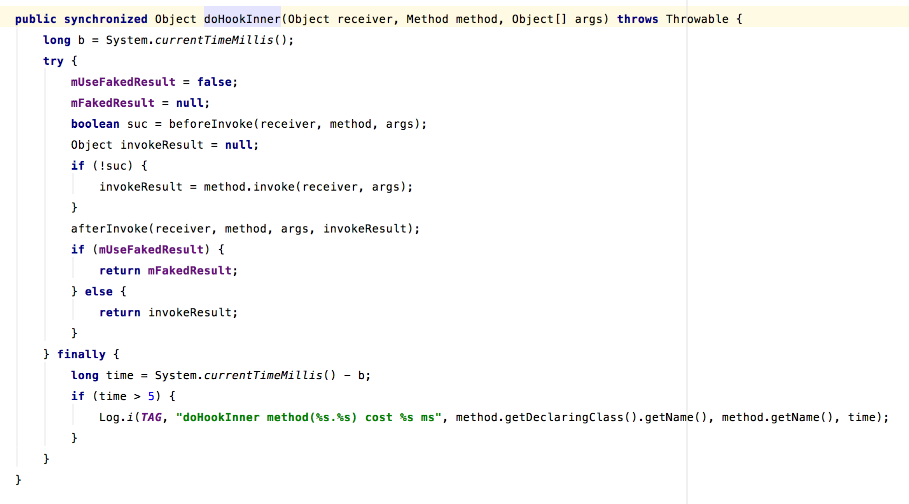

hook 系统api的过程

### 1.xxxBinderHook

在初始化方法中，会调用init方法去初始化需要hook的api方法，和其对应的HookedMethodHandler方法，在binderhook中，会根据方法名查询处对应的HookedMethodHandler，然后doHookInner执行hook方法。

* 调用beforeInvoke判断是否需要hook
	* 如果需要，就hook
	* 不需要的话  不做任何操作
* afterInvoke

到这里，整个的大体流程就走完了，接下来就是具体说一下hook的逻辑，这需要我们对framework非常了解，然而我并不是很了解，所以 这里存档了。

### 2.	
 